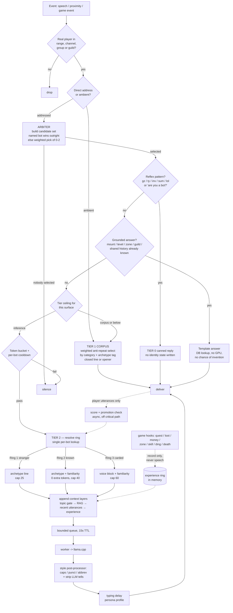

# Architecture

`mod-hearthside-chat` gives AzerothCore playerbots LLM-driven chat without sending every line
through the GPU. Reflex, ambient, and reactive chatter have different latency requirements and
different costs, so they run through different mechanisms. Only one of them ever touches the LLM.

Two ideas are kept strictly apart throughout, and conflating them is the most common way to design
the wrong thing here:

- **Tiers decide whether a bot speaks, and how expensively.** They are ranked, and one config
  ceiling per surface caps how far up a given surface may reach.
- **Context layers decide what is in the prompt when it does.** They are not ranked, they never
  make a bot speak, and no ceiling applies to them.

## The tiers

- **Tier 0 — Reflex** (`hs_reflex.*`). A hardcoded pattern table for the highest-volume, lowest-value
  inputs (`gz`, `ty`, `inv`, `sum`, `lol`, `wb`), plus the "are you a bot?" deflection and personal-probe
  privacy deflection. No GPU, no identity writes, no state of any kind.
- **Tier 1 — Corpus** (`hs_corpus.*`, `hs_opener.*`, `hs_script.*`, `hs_ambient.*`). Pre-generated lines
  selected with zero runtime GPU work, filled by an idle-time background generator (`hs_generator.*`).
  Covers ambient "dead air" flavor on `/say`, in party/raid, and on the global channels
  (`hs_channel.*` owns per-channel policy), **openers** (short, question-shaped lines that fire on five
  shared-context triggers — group formed, joint kill, rez, dungeon complete, and prolonged proximity at
  a shared objective or flight master — and exist specifically to bootstrap reactive conversation), and
  **scripted bot-to-bot conversations** (whole two-hander exchanges generated and audited ahead of
  time, then replayed near a real player — never improvised live).
- **Grounded answers** (`hs_grounded.*`). A fourth branch alongside the tiers, not above or below
  them: for questions the realm's own database already answers (mount, level, zone, guild, activity,
  shared history with this player), look it up and fill a template. No GPU, no chance of invention.
  Sits between the reflex check and the tier-ceiling check, since it is cheaper than a ceiling
  decision and strictly more truthful than inference.
- **Tier 2 — Reactive** (`hs_llm.*`, `hs_queue.*`). Live inference through a bounded queue: single
  worker, TTL, global token bucket, per-bot cooldown, and a circuit breaker for backend-down.
  Low volume by construction (proximity plus real-player gating). Also covers three self-initiated
  extensions, each its own tier ceiling and each gated separately from a direct reply:
  **engagement follow-ups** (`hs_engagement.*`, `MaxTier.EngagementFollowUp`) — a bot continuing a
  conversation on its own initiative after answering a player once, fire-chance decaying per chain
  depth; **event reactions** (`hs_event*.*`, `MaxTier.Events`) — a bot reacting to something that
  *happened* (a death, a ding, a duel) rather than something said, arbitrated by involvement and
  per-archetype affinity, own token bucket; and **live bot-to-bot chains** (`hs_botchain.*`,
  `MaxTier.BotToBot = inference`) — one bot's delivered line seeding another's reply on party, raid,
  or the General channel, depth-capped and decayed per hop.

Openers' fifth trigger and engagement follow-ups both run off one shared periodic scan
(`HsEngagementScanWorldScript`, 30s tick) rather than a per-utterance chat hook — see below.

## The context layers

Five sources feed the prompt, and they split along two axes. Picking the wrong one is the usual
mistake, so the axes are worth holding onto: **about the bot** versus **about the world**, and
**now** versus **remembered**.

| Layer | Files | Scope | Storage |
|---|---|---|---|
| Topic gate | `hs_topic_gate.*` | this bot, right now — gear, group, instance, gold, zone | snapshotted per request |
| Ambient experience | `hs_experience.*` | this bot, lately — quests, loot, dings, deaths, zones, professions | in memory, volatile |
| Memory | `hs_memory.*` | this bot **and one player** — shared history | `hside_memory`, durable |
| Grounded | `hs_grounded.*` | the world, right now — this realm's live state | queried per request |
| World knowledge (RAG) | `hs_rag.*` | the world, always — authored WotLK facts | `hside_rag`, from `data/rag/*.json` |

Three of these only ever *inform* a reply. Grounded answers and memory recall are the exceptions:
both can also *be* the reply, through the template path, which is why they sit in the flow above
rather than only in the prompt.

**Ambient experience is the one that most invites being built wrong.** Its seven hooks (quests,
loot, money, zone changes, professions, dings, deaths) overlap with `hs_event.*`'s, but nothing it
records ever makes a bot speak. An event is a backdrop, not a topic: a bot that wiped twice in
Sholazar should sound like it, not announce it. Repeats collapse into a count rather than stacking,
which is both what makes the noisy hooks affordable and the only wipe-shaped signal the module has.
It is in memory only on purpose — a relationship should outlive a restart, "recently" should not.

**Retrieval has two accessors and they are not interchangeable.** `Hs_RagContextFor` scores free
text (a player's message); `Hs_RagContextForKeys` addresses an entry by id or title and is what a
caller holding a name the *game or server* supplied must use (a map name from `Map::GetMapName`, a
zone label, a generator bucket), since it skips the threshold entirely. A third,
`Hs_RagContextRandom`, exists for callers with nothing to look anything up *with* — the generator's
untagged buckets and a script's first turn. See [`data/rag/README.md`](../data/rag/README.md).

Everything above is concatenated into one `personaLine` in `hs_queue.cpp`'s `WorkerLoop`, alongside
the archetype line, the card voice block and the recent-utterance echo. Order matters: the
experience block is appended **last**, because it is the only segment that changes as a bot plays,
so keeping it at the end leaves the whole prefix above it reusable by the backend's prompt cache.

## The arbiter

`hs_arbiter.*` sits ahead of tier routing, not inside tier 2. A chat hook fires once per utterance;
the module builds one candidate set and picks 0-2 responders before any tier (including reflex) is
even considered. Resolving "who answers" once, up front, is what stops six bots in range from firing
an identical `gz` at the same level-up — the same defect as "four bots answer the same question,"
solved once instead of per tier.

`hs_event_arbiter.*` is its sibling for things that *happen* rather than things said, and it exists
because three questions the `/say` arbiter cannot express matter there: involvement (the bot that
died has different standing from one that watched), per-event archetype affinity, and per-event
reply count. Its count bias is mostly a suppression device — most deaths pass without comment.

## Decision flow

The diagram below traces the direct-reply path, triggered once per utterance. Engagement follow-ups
and the opener's prolonged-proximity trigger fire off the periodic scan instead, but funnel into the
same bucket/cooldown gates, delivery queue, and style pass once admitted.

One gate sits *above* everything below and is not in the diagram, because it applies only to the
three producers that speak in `/say` with no trigger at all — ambient musing, openers, and
proximity scenes. Each requires the speaker to be *settled* — stationary (`isMoving()`) **and** in
`RPG_REST` or `RPG_WANDER_NPC` (`Hs_IsBotSettled`, `hs_rpgstate.h`). Both halves are needed: the
state alone covers the travel to a place as well as the time spent there, and stillness alone fires
on every loot pause of an active quest. A bot mid-quest or running to a grind spot is silent on that
surface regardless of what the rest of the flow would allow. Ambient additionally
requires a second bot in earshot, so the line reads as overheard rather than addressed. Because
those gates are narrow and their bite depends on live realm conditions, the roll each producer
ends on is a config key (`Ambient.Say.FireChancePercent`, `Openers.FireChancePercent`,
`Script.Proximity.FireChancePercent`) rather than a compiled constant. Direct replies, party/raid/
guild and the global channels are deliberately untouched by all of this.

The promotion check never runs in the request path, and can trigger idle-time card generation. The
experience ring is written by hooks on the world thread and read by the worker thread; it is drawn
dotted because nothing on that path ever produces speech on its own.

## Identity rings

Depth is earned, not universal: 5000 one-line strangers, a bounded population of characters with
real memory, a few dozen with a full character card. See `Claude/PLAN.md` §4.12 for the full design
rationale (why rings are derived rather than stored, why familiarity is a scalar and recall is a
lookup rather than injected text, and the cache economics that make a "carded" bot affordable).

## Where to look next

- `Claude/PLAN.md` — the design decisions behind every mechanism above, and why the alternatives were
  rejected. Event-reaction arbitration and trade-price grounding were designed in their own files
  (`Claude/PLAN-ARBITER.md`, `Claude/PLAN-TRADE.md`) and are both shipped; those files are now frozen
  history under `Claude/archive/`.
- `Claude/PROGRESS.md` — what is built and how each step was verified.
- `data/rag/README.md` — authoring rules for world knowledge, and the retrieval failures each one
  was learned from.
- `conf/mod_hearthside_chat.conf.dist` — every `HearthsideChat.*` config key, commented.
- `data/sql/db-characters/base/` — the authoritative schema for every `hside_*` table.
- `hs_main.cpp` — startup/shutdown order for every `WorldScript`/`PlayerScript`, with comments on why
  each lifecycle got its own script.
