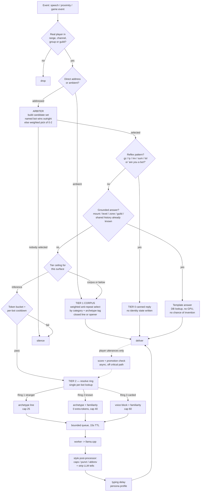

# Architecture

`mod-hearthside-chat` gives AzerothCore playerbots LLM-driven chat without sending every line
through the GPU. Reflex, ambient, and reactive chatter have different latency requirements and
different costs, so they run through different mechanisms. Only one of them ever touches the LLM.

## The tiers

- **Tier 0 — Reflex** (`hs_reflex.*`). A hardcoded pattern table for the highest-volume, lowest-value
  inputs (`gz`, `ty`, `inv`, `sum`, `lol`, `wb`), plus the "are you a bot?" deflection and personal-probe
  privacy deflection. No GPU, no identity writes, no state of any kind.
- **Tier 1 — Corpus** (`hs_corpus.*`, `hs_opener.*`, `hs_script.*`). Pre-generated lines selected with
  zero runtime GPU work, filled by an idle-time background generator (`hs_generator.*`). Covers
  ambient "dead air" flavor, **openers** (short, question-shaped lines that fire on five shared-context
  triggers — group formed, joint kill, rez, dungeon complete, and prolonged proximity at a shared
  objective or flight master — and exist specifically to bootstrap reactive conversation), and
  **scripted bot-to-bot conversations** (whole two-hander exchanges generated and audited ahead of
  time, then replayed near a real player — never improvised live).
- **Grounded answers** (`hs_grounded.*`). A fourth branch alongside the tiers, not above or below
  them: for questions the realm's own database already answers (mount, level, zone, guild, activity,
  shared history with this player), look it up and fill a template. No GPU, no chance of invention.
  Sits between the reflex check and the tier-ceiling check, since it is cheaper than a ceiling
  decision and strictly more truthful than inference.
- **Tier 2 — Reactive** (`hs_llm.*`, `hs_queue.*`). Live inference through a bounded queue: single
  worker, TTL, global token bucket, per-bot cooldown, and a circuit breaker for backend-down.
  Low volume by construction (proximity plus real-player gating). Also covers three self-initiated
  extensions, each its own tier ceiling and each gated separately from a direct reply:
  **engagement follow-ups** (`hs_engagement.*`, `MaxTier.EngagementFollowUp`) — a bot continuing a
  conversation on its own initiative after answering a player once, fire-chance decaying per chain
  depth; **event reactions** (`hs_event*.*`, `MaxTier.Events`) — a bot reacting to something that
  *happened* (a death, a ding, a duel) rather than something said, arbitrated by involvement and
  per-archetype affinity, own token bucket; and **live bot-to-bot chains** (`hs_botchain.*`,
  `MaxTier.BotToBot = inference`) — one bot's delivered line seeding another's reply on party, raid,
  or World, depth-capped and decayed per hop.

Openers' fifth trigger and engagement follow-ups both run off one shared periodic scan
(`HsEngagementScanWorldScript`, 30s tick) rather than a per-utterance chat hook — see below.

## The arbiter

`hs_arbiter.*` sits ahead of tier routing, not inside tier 2. A chat hook fires once per utterance;
the module builds one candidate set and picks 0-2 responders before any tier (including reflex) is
even considered. Resolving "who answers" once, up front, is what stops six bots in range from firing
an identical `gz` at the same level-up — the same defect as "four bots answer the same question,"
solved once instead of per tier.

## Decision flow

The diagram below traces the direct-reply path, triggered once per utterance. Engagement follow-ups
and the opener's prolonged-proximity trigger fire off the periodic scan instead, but funnel into the
same bucket/cooldown gates, delivery queue, and style pass once admitted.

The promotion check never runs in the request path, and can trigger idle-time card generation.

## Identity rings

Depth is earned, not universal: 5000 one-line strangers, a bounded population of characters with
real memory, a few dozen with a full character card. See `Claude/PLAN.md` §4.12 for the full design
rationale (why rings are derived rather than stored, why familiarity is a scalar and recall is a
lookup rather than injected text, and the cache economics that make a "carded" bot affordable).

## Where to look next

- `Claude/PLAN.md` — the design decisions behind every mechanism above, and why the alternatives were
  rejected.
- `Claude/PLAN-ARBITER.md` / `Claude/PLAN-TRADE.md` — event-reaction arbitration and trade-price
  grounding, two newer efforts layered on top of `PLAN.md`'s design, tracked separately.
- `conf/mod_hearthside_chat.conf.dist` — every `HearthsideChat.*` config key, commented.
- `data/sql/db-characters/base/` — the authoritative schema for every `hside_*` table.
- `hs_main.cpp` — startup/shutdown order for every `WorldScript`/`PlayerScript`, with comments on why
  each lifecycle got its own script.
